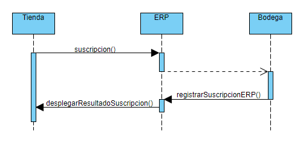
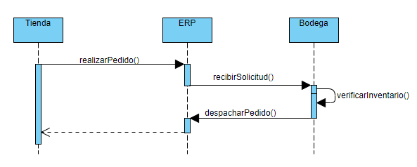
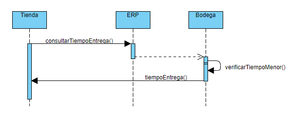
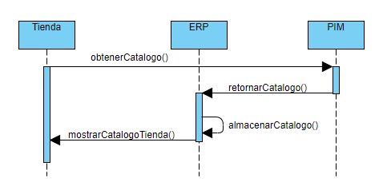
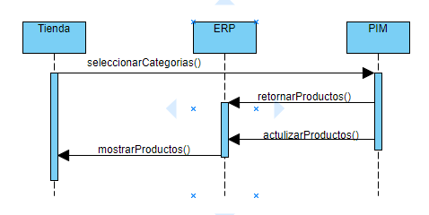
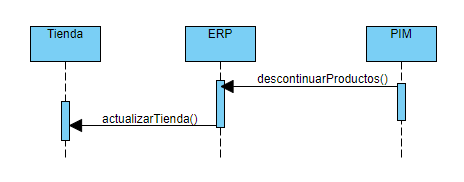
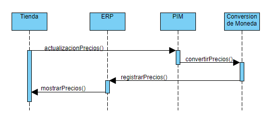
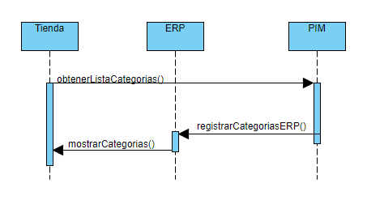

# Entregable Numero 1

Para antes poder plantear cual sera la topología a utilizar debemos escoger que estructura de negocio se acopla mas al conglomerado 
de negocios que vamos a analizar. De las diferentes estructuras consideramos que es una mezcla de dos estructuras estas siendo :

1. Red de Tiendas/ Sucursales ( Store/Branch Network )
2. Multiples Geografías

Esto basado en que el conglomerado se organiza geograficamente y cada región opera parcialmente independiente , pero si de forma sinérgica 
en apoyo a los objetivos globales de la empresa, de igual forma se presentan funciones de integración, procesos y capacidades bajo el 
control cental o regional.

## Topología Propuesta
[topologia] https://s3.amazonaws.com/renato1689/Topologia.jpg "Topologia"

### Single Logical ESB (Descartada)
Consideramos no ser adecuada ya que en el conglomerado cada tienda implementara su ERP Y Tienda en linea de forma individual

### Directly Connected ESB with Single Registry ( Descartada )
Debido a que esta topología es mas adecuada cuando los servicios son manejados por las distintas unidades de negocio centralmente,
es correcto decir que el ERP y la Tienda son distintas unidades de negocio pero sin embargo no son centralizadas.

### Directly Connected ESP with multiple Registry ( Descartada )
Por la misma razon que la anterior, ya que usualmente es mas adecuada cuando las unidades de negocio estan centralizadas aunque se
accedan desde muchos puntos.

### Brokered ESB ( Descartada )
La razon para descartar esta topología , es por razones de limitaciones en el proyecto ya que se tiene planeado tomar a cada grupo con su
implementacion de ESB y unirlos para realizar las pruebas, esta topología necesita de un orquestador central el cual probablemente no es
viable implementar por cuestiones de tiempo y coordinacion necesaria para soportar todos los frameworks que cada grupo utilizará

### Hub and Spokes ESB ( Adecuada )
Usualmente diseñada para modelos de negocio de sucursales , en la cual cada Hub tiene control de la implementacion y desplegue del ESB,
lo cual se adapta a los requerimientos del proyecto tanto en implementación como pruebas.

### Imposed ESB ( Descartada )
Descartada no por razones tecnicas sino debido a restricciones del proyecto ya que en esta topologia, las oficinas centrales o altos 
mandos de IT proveen de todo lo necesario para implementar y desplegar los ESB en cada HUB, lo cual es descartado ya que el enfoque del
proyecto es que se desarrolle el ESB.

## Definicion de Servicios
### Servicios Web de Entidades
#### Tiendas
1. Subscribirse a Bodega
	- 
2. Solicitar Despacho
	- 
3. Consultar Tiempo de Entrega
	- 
#### PIM
1. Obtener Catalogo Completo
	- 
2. Selección de categorías y productos a vender
	- 
3. Obtener Productos Descontinuados
	- 
4. Actualizar Precios basados en moneda local
	- 
5. Obtener Lista por Categorias
	- 
#### Bodegas
1. Obtener Inventario Real
2. Tiempo de Entrega
3. Registrar Subscripcion
4. Recibir Solicitud de Despacho
5. Enviar Inventario

La secuencia de operaciones de los servicios de bodega se encuentran ilustrados en los diagramas de secuencia de Tiendas.

### Protocolos a Utilizar
1. Propongo REST para los servicios 
2. AMQP para colas
### Operaciones
#### Tiendas
1. Realizar suscripcion a bodega
  - Nombre de la funcion: suscribirse
  - Explicacion: Una tienda, con su propio id, podra suscribirse a una bodega del mismo o diferente pais para llevar a cabo los despachos al momento de que se lleve a cabo una compra.
  - Parametros de entrada:
    - Codigo de tienda (tentativamente de tipo entero)
    - Codigo de bodega (tentativamente de tipo entero)
  - Respuesta: la respuesta sera de tipo booleano, true si se pudo realizar la suscripcion y false si no.
2. Solicitar despacho
  - Nombre de la funcion: solicitar_despacho
  - Explicacion: Al momento de generarse una orden por un cliente, la tienda solicita el producto a las bodegas a las que esta suscrita.
  - Parametros de entrada:
    - Codigo de tienda (tentativamente de tipo entero)
    - SKU (tentativamente de tipo entero)
    - Cantidad (entero)
  - Respuesta: la respuesta sera el tiempo en dias que se tardara en realizar el despacho a la tienda.
3. Consultar tiempo de entrega
  - Nombre de la funcion: consultar_tiempo_entrega
  - Explicacion: La tienda, al realizar un pedido podrá consultar el tiempo de entrega a las bodegas en las que esta subscrito.
  - Parametros de entrada:
	- Fecha de realizacion del pedido (tipo fecha)
	- Codigo de tienda (tentativamente de tipo entero)
  - Respuesta: la respuesta sera el tiempo en días en que se entregará el producto (tipo entero)
#### PIM
1. Obtener catálogo completo 
  - Nombre de la función: obtener_catalogo
  - Explicación: Esta función se utilizará para obtener el catalago completo existente del PIM, perdo devolviendo únicamente los siguientes datos: nombre,SKU y categorias de cada producto.
  - Parámetros de entrada: 
	- No posee parametros de entrada
  - Respuesta: Se retornará un arreglo que contiene el catálogo de productos.
2. Selección de categorías y productos a vender
  - Nombre de la función: seleccionar_productos
  - Explicación: A través de esta función las tiendas podrán seleccionar las categrías y productos que se venderán .
  - Parámetros de entrada:
	- Codigo de tienda (tentativamente de tipo entero)
	- Categorias seleccionadas (un arrelgo con las categorías seleccionadas)
  - Respuesta: Se retornará la porción del catálogo de productos según las categorías seleccionadas en un arreglo.
3. Obtener productos descontinuados
  - Nombre de la función: descontinuar_productos 
  - Explicación: Se desligarán de las tiendas los productos que han sido descontinuados por el PIM y se le colocara un estado de descontinuado al producto.
  - Parámetros de entrada:
	- Productos descontinuados (un arreglo con los productos descontinuados)
  - Respuesta: El estado de la operación.
4. Actualizar precios basados en moneda local
  - Nombre de la función: actualizacion_precios
  - Explicación: Con esta función se podrán actualizar los precios reales en base a la moneda local de cada tienda. No será necesario indicar la moneda o la ubicación de la tienda debido a que estos datos pueden obtenerse por medio del codigo de la tienda.
  - Parámetros de entrada:
	- Codigo de tienda (tentativamente de tipo entero)
  - Respuesta: Un arreglo que tiene la información del precio de los productos en la moneda local.
5. Obtener lista por categorias
  - Nombre de la función: obtener_lista_categorias
  - Explicación: Por medio de esta función se obtendrán los datos de cada producto en el catálogo, clasificados por categorías. Los precios serán mostrados en la moneda local. No será necesario enviar las categorías seleccionadas como parámetro debido a que estas pueden obtenerse por medio del código de la tienda.
  - Parámetros de entrada:
	- Codigo de tienda (tentativamente de tipo entero)
  - Respuesta: Se retornará un arreglo con la porción del catálogo seleccionado, incluyendo el precio real de los productos en la moneda local.
#### Bodegas
1. Obtener inventario real
  - Nombre de la función: obtener_inventario
  - Explicación: Se obtendrá de la base de datos de la bodega el inventario real del producto enviado como parámetro antes de realizar una compra.
  - Parámetros de entrada:
	- Codigo de tienda (tentativamente de tipo entero)
	- SKU del Producto (tipo entero)
  - Respuesta: Se retornará el número de unidades existentes del producto solicitado.
2. Tiempo de entrega
  - Nombre de la función: calcular_tiempo_entrega  
  - Explicación: Recibirá la consulta de la tienda del tiempo de entrega. Verificara cual es el tiempo de entrega menor entre las bodegas en base a la ubicacion de la tienda para retornar un resultado.
  - Parámetros de entrada: 
	- Codigo de tienda (tentativamente de tipo entero)
  - Respuesta: Se retornará un entero que indique la cantidad de días que demorará la entrega.
3. Registrar subscripcion
  - Nombre de la función: registrar_suscripción 
  - Explicación: Recibirá la solicitud de sucripción de una tienda a la bodega y realizará el registro en la respectiva base de datos.
  - Parámetros de entrada:
	- Codigo de tienda (tentativamente de tipo entero)
	- Codigo de bodega (tentativamente de tipo entero)
  - Respuesta: La respuesta sera de tipo booleano, true si se pudo realizar la suscripcion y false si no.
4. Recibir solicitud de despacho
  - Nombre de la función: procesar_despacho 
  - Explicación: A través de esta función la bodega realizará el registro de la compra realizada en la base de datos. La bodega que atenderá el pedido será la calculada según el inventario existente y el tiempo de entrega.
  - Parámetros de entrada:
	- Codigo de tienda (tentativamente de tipo entero)
    - SKU (tentativamente de tipo entero)
    - Cantidad (entero)
  - Respuesta: La respuesta sera el tiempo en dias que se tardara en realizar el despacho a la tienda. Si no se comple con las condiciones de la solicitud se retornará un -1 indicando que la solicitud del despacho no ha podido realizarse.
5. Enviar inventario
  - Nombre de la función: enviar_inventario 
  - Explicación: Se realizará el envió del inventario existente de determinado producto solicitado por la tienda para verificar existencias.
  - Parámetros de entrada:
	- Codigo de tienda(tentativamente de tipo entero)
	- SKU del producto (entero)
  - Respuesta: Se retornará un entero que contendrá el número de unidades existentes del producto enviado como parámetro.
### Autenticación
#### Funciones afectadas
De los servicios web especificados anteriormente, se necesita llevar el control de la autenticacion para proteger la informacion privilegiada o privada de la empresa propietaria del proyecto. No todos los servicios web deben de llevar proceso de autenticacion, pero los que si son los siguientes:
- Suscribirse a bodega, solo una tienda puede realizar la suscripcion a una bodega.
- Solicitar despacho, solo una tienda puede solicitar producto a bodega para despachar a un cliente.
- Seleccion de categorias y productos a vender, solo un administrador o gerente de tienda sera capaz de elegir que categorias mostrar a los clientes y que productos pueden vender.
- Actualizar precios basados en moneda local, solo el administrador de la PIM puede llevar a cabo las modificaciones correspondientes.
- Registrar suscripcion, solo un usuario de bodega puede llevar a cabo tal operacion.
- Recibir solicitud de despacho, la bodega es la unica entidad capaz de despachar a la tienda.

Ademas de los servicios especificados, tambien se deberian de autenticar los servicios que se incluyan en la parte de login de un cliente o empleado. Esto para mantener las claves de acceso seguras a infiltradores.

#### Protocolo de Autenticación
Propongo JWT por versatilidad y disponibilidad en varios lenguajes
#### Roles y niveles de usuario a crearse
Los roles y niveles de usuario a crearse seran los siguientes:
- Administrador: El administrador poseera los permisos para poder modificar y acceder a los datos del PIM.
- Administrador de tienda: El administrador de la tienda podra gestionar los productos que puede poner en venta del catalogo que el PIM le ofrezca y administrar los datos de la tienda, asi como suscribir su tienda a una bodega. 
- Tiendero: EL tiendero funcionara como otro cliente mas, pero podra hacer solicitud de despacho a las bodegas.
- Administrador de bodega: El administrador de bodega podra registrar tiendas.
- Bodeguero: Este rol lo tendran los usuarios que pueden ver las solicitudes de despacho para ser despachadas.
- Cliente: El cliente es la capa mas inferior y este podra ver:
  - El catalogo de productos.
  - Realizar compra de productos.
  - Ver el tiempo de despacho.
  - Otras operaciones que involucren en el pago y compra de productos.
